# Flight Predictions

- [The Problem](#the-problem)
- [Data](#data)
  - [Data Preprocessing](#data-preprocessing)
  - [Exploratory Data Analysis](#exploratory-data-analysis)
  - [Evaluation Metrics](#evaluation-metrics)
- [Models](#models)
  - [Training](#training)
  - [Validation](#validation)
- [Results](#results)
- [Sample Video](#sample-video)
- [Model Notebook](#model-notebook)

# The Problem

Airline delays can be a major inconvenience for travelers, causing them to miss connections, arrive late to their destination, and disrupt their plans. These delays can occur due to a variety of factors, including weather, mechanical issues, and air traffic congestion. For frequent travelers, delays can be especially frustrating, as they can lead to interrupted plans and increased stress.

To address part of this issue, we are creating a machine learning model to predict if a given flight would have a weather delay and if so, approximately how long that delay would be. By analyzing historical data on flight patterns and delays, the model will be able to identify patterns and make predictions about the likelihood and length of delays for future flights. This information will allow travelers to preemptive measures to their travel and plans. This will also allow airlines to proactively take steps to prevent delays, such as adjusting flight schedules. Ultimately, this will help improve the experience for travelers and help airliners better prepare for future delays. The machine learning model of this project aims to accurately answer the question ***“Will my flight be delayed due to weather?”*** and if so, ***“How long will the delay be?”***

# Data

Our flight-related data comes from [Kaggle’s 2015 Flight Delays and Cancellation](https://www.kaggle.com/datasets/usdot/flight-delays?select=airports.csv) dataset. This data includes flight information such as airline, airport origin, airport destination, city, state, country, latitude of origin, longitude of origin, and what day the flight occurred. We mapped weather-related data from Climate.gov’s [Past Weather by Zip Code Datatable](https://www.climate.gov/maps-data/dataset/past-weather-zip-code-data-table) to the Kaggle dataset. These two datasets combined allow for our model to factor in previously known information such as flight origin and destination, flight time, airport temperature, precipitation, wind speed, and more for the model to predict the delay time. 

From the Kaggle dataset, there are approximately 5 million samples to train, evaluate, and test the model on. To obtain weather information about all the flights, it would take a manual process of entering the zip code and year for every location of the flights in the Kaggle dataset and then downloading a CSV file for each area. This would take an unreasonable amount of time, so we decided to focus on flight information only coming from Chicago’s O’Hare International Airport (ORD). This airport is a major international airport in a location that has a large span of weather variations from hot summers to harsh winters with extreme cold and snow. Using only data focused on Chicago, there are approximately 285,000 flight samples to use.

Some shortfalls of this data are that all the flight information comes from one year. For future work, we would be able to have information about all flights from the O’Hare International Airport over a large span of years. Additionally, all the information is about U.S. domestic flights, and due to a large number of sample locations, we had to focus only on the Chicago airport. The model will be most reliable in predicting delays for flights out of Chicago, but it could potentially be generalized to be used for other airports, with less reliability.

## Data Preprocessing

To start our data preprocessing, we locally removed all columns that contained data not known pre-flight. This helped us to limit the scope of our analysis and focus only on the pre-flight data. We removed data columns such as TAXI_OUT, WHEELS_OFF, ELAPSED_TIME, AIR_TIME, WHEELS_ON, TAXI_IN, ARRIVAL_TIME, DIVERTED, CANCELED, and CANCELLATION_REASON.

Additionally, delay result columns such as AIR_SYSTEM_DELAY, SECURITY_DELAY, AIRLINE_DELAY, LATE_AIRCRAFT_DELAY, DEPARTURE_DELAY, and ARRIVAL_DELAY were also removed locally as the scope of our project focused on predicting Weather Delays and therefore other delays would not be known pre-flight.

The definitions of the dropped features are listed in Figure 1.

| Feature Name | Meaning |
| :---: | --- |
| TAXI_OUT | Time, in minutes, between departure from the gate and takeoff |
| WHEELS_OFF | Time, in minutes past midnight, when the aircraft's wheels leave the ground |
| ELAPSED_TIME | Actual time, in minutes, that the aircraft is in the air |
| AIR_TIME | Time, in minutes, that the aircraft spends in the air during a flight, excluding time spent taxiing |
| WHEELS_ON | Time, in minutes past midnight, when the aircraft's wheels touch the ground |
| TAXI_IN | Time, in minutes, between the aircraft's wheels touching the ground and its arrival at the gate |
| ARRIVAL_TIME | Time, in minutes past midnight, when the aircraft arrives at its destination |
| DIVERTED | Indicates whether the flight was diverted to a different airport |
| CANCELED | Indicates whether the flight was canceled |
| CANCELLATION_REASON | Reason for flight cancellation |
| AIR_SYSTEM_DELAY | Delay, in minutes, caused by the National Airspace System |
| SECURITY_DELAY | Delay, in minutes, caused by security issues |
| AIRLINE_DELAY | Delay, in minutes, caused by the airline |
| LATE_AIRCRAFT_DELAY | Delay, in minutes, caused by a previous flight arriving late |
| DEPARTURE_DELAY | Delay, in minutes, at the departure airport |
| ARRIVAL_DELAY | Difference, in minutes, between scheduled and actual arrival times |

Figure 1: Definition of dropped features

One-hot encoding creates new columns for each unique category in a categorical variable, where the value in each column is either 0 or 1 depending on whether the observation falls into that category or not. This way, the categorical data can be represented numerically, without implying any inherent ordering or hierarchy among the categories. We used one-hot encoding to encode categorical data such as the location of the flight and the name of the airport it is flying to. This helped us to prepare the data for use with a variety of machine learning models that require numerical data as input. It allowed us to work with a larger range of models, including neural networks.

Additionally, our model categorized delays into 9 categories based on the time of the delay. Those categories were:
1. <1 minute
2. 1-4 minutes
3. 4-11 minutes
4. 11-17 minutes
5. 17-25 minutes
6. 25-37 minutes
7. 37-59 minutes
8. 59-130 minutes
9. \>130 minutes

The category's delay ranges were intentionally chosen based on the distribution of our dataset, so that each category contained the same amount of delays (approximately 2% for each category, with the exception of <1 which had far more than any other category). 

Finally, to standardize the flight time across all flights, we converted the flight time into minutes past 12:00 AM value (0-1439). This allowed us to easily compare the flight times of different flights. Overall, these data preprocessing steps were crucial in ensuring that our analysis was accurate, reliable, and relevant to the research question at hand.

## Exploratory Data Analysis

We plotted correlations between delay time and weather variables such as minimum temperature, max temperature, temperature difference, and precipitation. This helped us to identify any patterns or trends between flight delays and weather conditions and visualize patterns our ML model might need to recognize.

Figure 2 displays the frequency distribution of flight delays. The graph clearly shows that the delays are skewed left, indicating that most flights tend to be on time or only slightly delayed, with a few flights experiencing significant delays. This is also supported by the given information which shows that the average delay is only 6.34 minutes, while the maximum delay is 991 minutes.

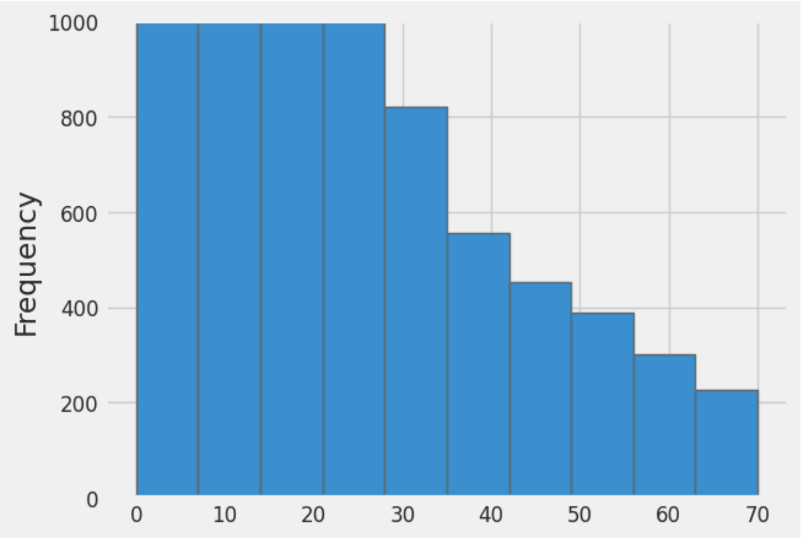

Figure 2: Bar graph showing the frequency of delays compared to the length of delay in minutes for all flights from the Chicago Airport in 2015

Moving on to Figure 3, the scatter plot of Delay Length vs Time of Day shows that there is no clear correlation between the delay length and time of day. There are some trends that have been previously supported, such as, for any given time the frequency of shorter delays is much greater. This was seen in the left skewness in Figure 1. 

From the time between 0-350, there is no flight with a delay length greater than 100 minutes. This pattern is likely due to a variety of factors. In the early morning, there are fewer flights and fewer passengers, so there is less congestion and fewer opportunities for delays to occur. Finally, it's possible that delays early in the day can set off a chain reaction that leads to other flights also getting delayed.

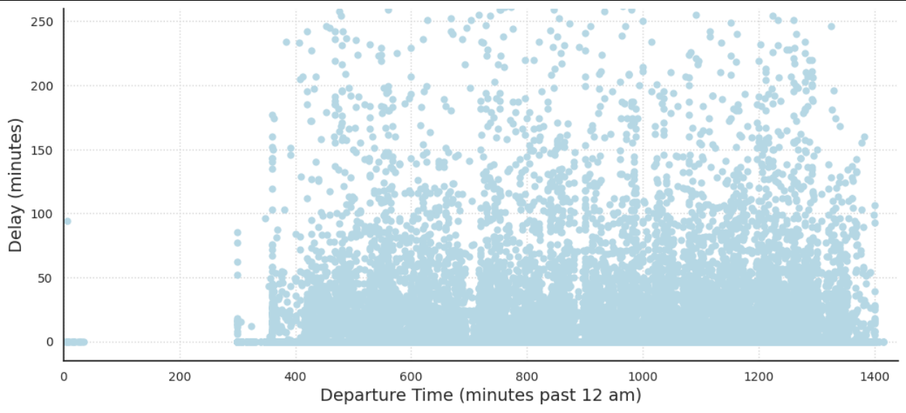

Figure 3: Delay Length vs Departure Time for all flights from the Chicago Airport in 2015

Intuitively, many people think about snow as a main factor in airport delays. Though as shown in Figure 4, the amount of snow does not necessarily have a clear correlation to the weather delay time. This could be for a number of reasons. First off, airports in colder climates have experience dealing with snowy conditions and often have developed methods of mitigation, allowing air traffic to run regularly even in snowy conditions. Secondly, the snow’s relationship with weather delays could be more complex than we can represent through a simple graph. For example, snow might not become a huge factor until the temperature dips below the airport’s de-icer’s "holdover time limit" temperature (minimum temperature at which a de-icer is expected to remain effective).

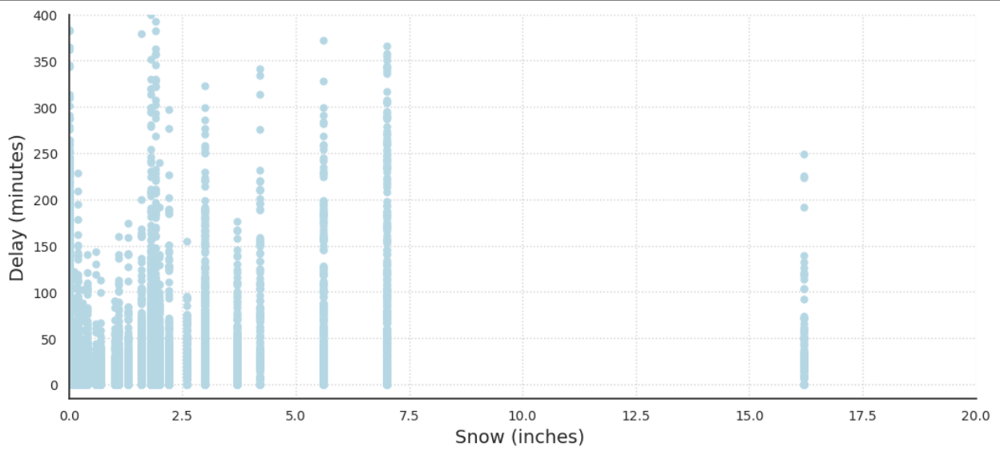

Figure 4: Delay Length vs Amount of Snow for all flights from the Chicago Airport in 2015

In Figure 5, the delay length compared to the amount of precipitation has a similar graph to the amount of snow. Figure 5 also includes all snowfall as it is a form of precipitation. This is likely why the graph suffers from unclear trends, as the amount of precipitation could contribute to weather delays in a more complex relationship. 

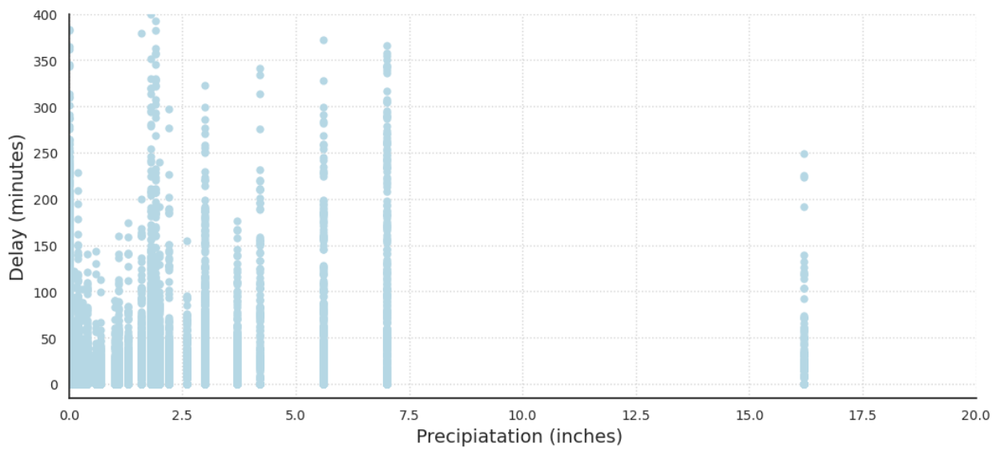

Figure 5: Delay Length vs Precipitation for all flights from the Chicago Airport in 2015

One of the most obvious and important features of our dataset is temperature. Generally, it is perceived that extremely cold and warm temperatures create delays and inconveniences in all aspects of day-to-day life. This idea is supported by the data. Figures 6 and 7, the delay length compared to the minimum and max daily temperature below demonstrates that. Both graphs take a U shape, demonstrating that extreme temperatures in either direction cause more frequent and drastic delays. 

Extreme temperatures, whether hot or cold, can have a significant impact on airport operations and contribute to flight delays or cancellations. In cold temperatures, equipment malfunctions such as frozen fuel lines or hydraulic systems can cause delays or cancellations. Icy conditions on aircraft wings can also affect aircraft aerodynamics and require additional de-icing precautions, leading to delays. In hot temperatures, runway conditions, and air density can reduce aircraft performance, leading to longer takeoff runs or cancellations. All of these factors could be viewed as explanations as to why our graphs for min and max temperatures take a U shape with respect to weather delays.

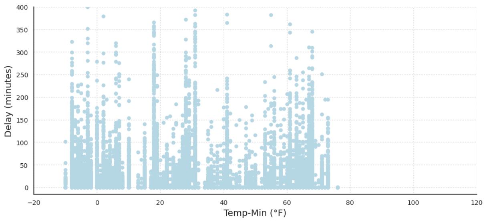

Figure 6: Delay Length vs Minimum Daily Temperature for all Days in Chicago in 2015

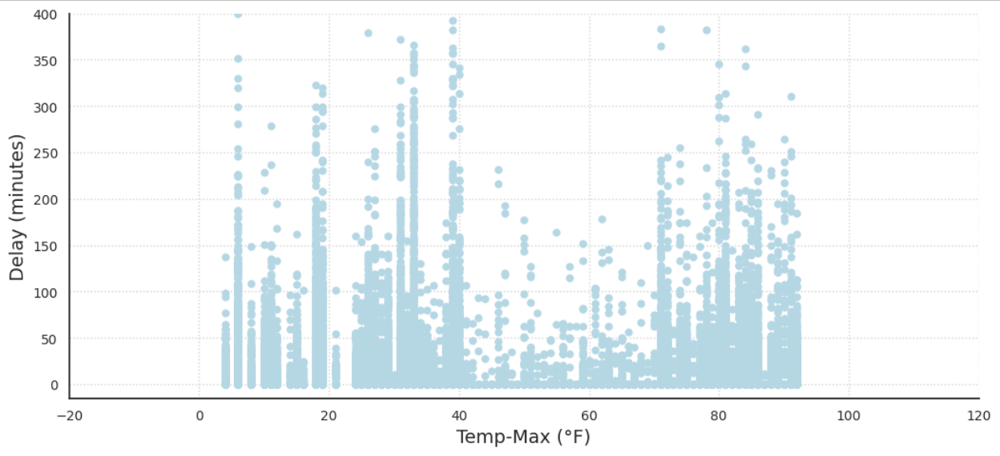

Figure 7: Delay Length vs Maximum Daily Temperature for all Days in Chicago in 2015

In Figure 8, the graph showing delay length compared to temperature difference shows no clear correlation between drastic differences in temperature and weather delays. It is worth noting that the lack of data points exceeding a 38-degree difference in daily temperature could contribute to the absence of a clear correlation between temperature difference and weather delays at Chicago International Airport. This suggests that the temperature changes at the airport are within a relatively narrow range, which may not cause significant disruptions to airport operations.

Furthermore, it is important to consider that weather patterns and conditions can vary widely across different regions and airports. While a lack of correlation may be observed at Chicago International Airport, this may not necessarily hold true for other airports or regions with different weather patterns.

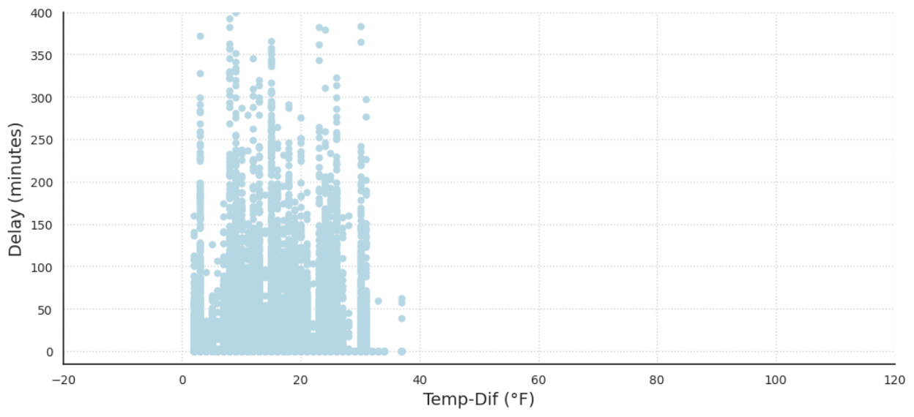

Figure 8: Delay Length vs Temperature Difference for all Days in Chicago in 2015

## Evaluation Metrics

The primary evaluation metric used for all models is the Keras accuracy score. This score measures the proportion of correct predictions made by the model on the test set. The accuracy score is a commonly used metric for evaluating classification models and can be interpreted as the overall correctness of the model's predictions.

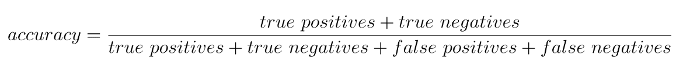

In addition to the accuracy score, we also evaluated the models using the validation loss, which was calculated using the categorical cross-entropy loss function in the neural network. The categorical cross-entropy is calculated as follows:

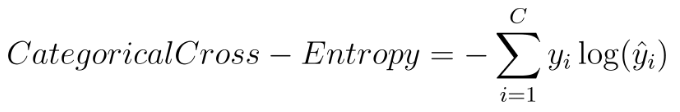

Where C is the number of classes, yi is the true label of the i-th class, and ŷi is the predicted probability of the i-th class.

Finally, we used the F1 score to evaluate the models. The F1 score is a metric that combines precision and recall, two important measures of the model's performance. It is calculated as follows:

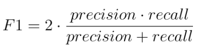

where:

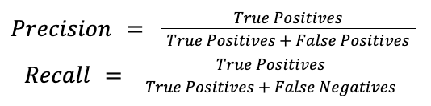

The F1 score ranges from 0 to 1, where 1 indicates perfect precision and recall. A high F1 score indicates that the model is able to achieve high precision and recall simultaneously, meaning that it can effectively identify true positive instances while minimizing false positives and false negatives. False positives (predicting a possible delay when there isn’t one), aren’t necessarily dangerous in our model since it is better to be on the cautious side, but we definitely want to minimize false negatives (predicting no delay when there is one) since if our model were to be used as a recommender to ATC, then people’s safety would be at stake. 

In this study, we aimed to develop models that accurately predict weather delays for aircraft with a high degree of precision and recall. To achieve this, we set target numbers for the evaluation metrics used in this study. The target numbers were an accuracy score of at least 80%, and an F1 score of at least 0.7. These target numbers were chosen based on previous research and domain expertise, as well as considering the consequences of false positives and false negatives in the context of flight delays. We aimed to develop models that can achieve high accuracy, minimize validation loss, and have a high F1 score, thus providing a reliable tool for airlines and passengers to plan their travel effectively.

# Models

We chose to train 4 types of models simultaneously: Neural Network, Gradient Boosted Trees, Random Forest, and K-Nearest Neighbors. These were chosen because they are well-suited for classification tasks and can provide different insights into the relationship between the input variables and the target variable. Each model has its own strengths and weaknesses, so by testing multiple models, we can gain a better understanding of which model performs best for our specific dataset.

Vanilla decision trees are unstable – a single new example has the potential to change the entire structure of the tree. Due to this, we decided to use 2 types of decision tree variants that have better performance – Gradient Boosted Trees and Random Forest.

## Training

Overall, we generally trained our models with a random subset of the data consisting of approximately 175,000 samples. The exceptions are mentioned below.

The NN was used because of the complex relationships snow, precipitation, and other weather data might have with each other. NN are good at finding complex relationships and may be able to account for problems like the snow de-icer "holdover time limit" temperature. For the NN, two activation functions were considered for the body of the network: the hyperbolic tangent (tanh) function and the rectified linear unit (ReLU) function. The output layer used the softmax activation function. 

Gradient Boosted Trees create a more accurate model because it trains multiple trees. Each new tree corrects the errors made by the previous trees. This is a good choice for our use case because many of the flights have similar data - airlines repeat the same routes multiple times over the course of the year. However, some of these end up delayed and others don’t. The gradient-boosted trees have the potential to mitigate this problem by correcting for errors and capturing the subtleties.

Random forest models train multiple trees at once. These trees are forced to pick from a random subset of features that diversifies them. Together, the trees create a forest that is collectively more stable and potentially more accurate than the rest of the trees. A major disadvantage of random forest models is that they take a long time to train.  We trained our random forest model on a subset (~20%) of the training data. 

For KNN, the model was limited to 50k data points to allow for efficient usage. The rationale behind using the KNN model is similar to Gradient Boosted Tree, as many of the flights have similar data. A KNN model could look for flights with similar feature values and use their outcome (delayed or not) to predict the outcome for the flight in question.

## Validation

For the majority of our models hyperparameter tuning was done to find the best combination of model parameters that would produce the most accurate results. This was important because using the wrong combination of hyperparameters can lead to overfitting or underfitting of the model. By tuning these parameters, we ensured that our models were optimized for accuracy and performance, allowing us to accurately compare them.

For the NN, after overfitting on our initial few trials early stopping was implemented to prevent overfitting, and dropout layers were added between all hidden layers with 20% dropout (also to prevent overfitting). The hyperparameters of the hidden layers and neurons were tuned using a grid search. Hidden layers were varied from 1 to 14 (we found in testing that more hidden layers did not affect validation accuracy), and neurons were tuned for values between 30 and 290. All combinations of the number of neurons and hidden layers were tested, and the validation score was plotted to determine the optimal configuration. The most optimal hyperparameters were 6 hidden layers with 180 neurons per layer.

For the Gradient Boosted Trees, we used the hyperparameter template suggested by the official keras documentation and this did not significantly improve performance. We decided not to pursue further hyperparameter tuning because the model took an excessively long time to run.

For the Random forest model, we decided not to pursue hyperparameter tuning with this model because the model also took a very long time to run.

For the KNN, the hyperparameter k was tuned for values between 1 and 20. The accuracy score was plotted against the values of k to determine the most optimal k value of 5.

# Results

Overall, our models had solid performance! With the best being the Gradient Boosted Tree Model.

For the NN model, the test accuracy was approximately 76.67% with an F1 score of about 67%. These values are decent, but not as good compared to other models. Considering the validation accuracy was around the same, this model is probably underfitting. It is likely it needed hundreds of layers for improvement and that is why there was little change within the grid search hyperparameter tuning. In our experience, this would have taken 6 hours or more which is very hard to coordinate, since Google Colab required browsers to be open to run.

For the Gradient Boosted Tree Model, the training accuracy was approximately 81% and the test accuracy was approximately 80%, which was high compared to the other models. The F1 score was 75.35%. This is by far our best model. Additionally, it was insightful in determining the features that were most important. The top 5 features (in order): Airline, average wind, day of the month, day of the week, and destination airport. However, this model takes a long time to train so we were not able to implement hyperparameter tuning. With hyperparameter tuning, it could possibly do even better. Given that our training and test accuracy were similar, the model has low variance, but it potentially has high bias, so the model is underfitting a little, and the accuracy and F1 score could be improved by feeding more data to the trees or using a more complex model. 

For the Random Forest model, the training and test accuracy were both approximately 77.11%. The F1 score is 75.27%. This is our second-best model and is impressive because it is only operating on 20% of the training data. Like the GBT model, the variance was low, but the bias was a little high, so the model is underfitting and perhaps letting the model run longer on more data would improve the fit. 

Finally, the KNN model produces a test accuracy of approximately 76.67% while only using 28% of the training data. The F1 score is 66.55%. This is pretty bad and the model overfit heavily as its validation accuracy was 86%.

Overall, our models performed very well! The Bayes Error for predicting a flight delay is notoriously high among frequent fliers. The actual error is really unknown since we would have to conduct human testing to find the true value. Our accuracy for our best model is 80% with an F1 score of 75%, which we believe is much better than a human might do. The Bayes error is assumed high since the human would likely have trouble predicting which of the 9 categories of delays the flight fits into.

In the future, we could look into using RNNs and adding even more weather features. These features could describe hourly weather corresponding to the time of the flight so that weather patterns are more visible. Totals for precipitation, snow, and ice for  24, 12, and 6 hours could also be added to give context on how runway conditions might be affected. In addition to new weather features, the model could also be extended to other airports and throughout multiple years to give a more generalizable model that can be used for predicting weather delays for flights anywhere. Finally, our best model (the Gradient Boosted Tree) could be tuned for hyperparameters in the future, but this took far too long for us to implement during this project.

# Sample Video

You can view a video of our model [here](https://youtu.be/IZXU83XKpPo).

# Model Notebook

Click the link below to run our notebook in Google Colab.
<!-- Will possibly need to update the link once we get the final notebook. -->
<table align="left">
  <td>
    
  </td>
</table>
     